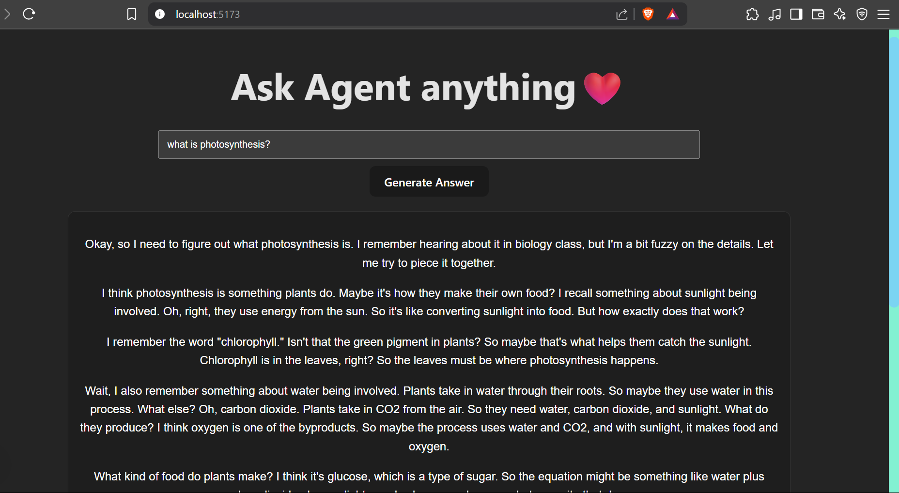
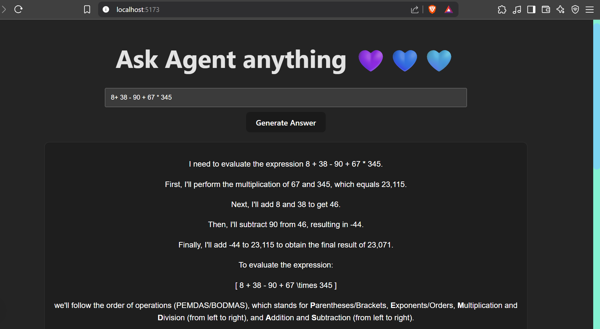

 
---

# AI Research Assistant — Powered by DeepSeek + LangChain

An intelligent research tool that combines a **React frontend** with a **Python LangChain backend**. It utilizes Together AI's **DeepSeek-R1-Distill Llama 70B model** to generate structured research summaries, enriched using custom tools like Wikipedia search and saving utilities.

---

##  Folder Structure

```
.
├── tools.cpython-311.pyc         # Compiled Python tools module
├── ai-research-frontend/         # Frontend React App (Vite-based)
│   ├── __pycache__/              # (Generated cache - safe to ignore)
│   ├── node_modules/             # Dependencies
│   ├── public/                   # Static assets
│   ├── src/                      # Frontend source code
│   │   ├── assets/               # (Optional image/font files)
│   │   ├── App.jsx               # Main app logic
│   │   ├── App.css               # App styles
│   │   ├── index.css             # Global styles (scrollbar, theme)
│   │   └── main.jsx              # Entry point for React
│   ├── .env                      # API Key for Together AI (VITE_)
│   └── .gitignore
```

---

## 🚀 Features

* **Backend Agent**: LangChain agent that uses:

  * `search_tool`
  * `wiki_tool`
  * `save_tool`
* **Frontend UI**: Clean input/output interface using:

  * Markdown rendering via `marked`
  * Math rendering via `KaTeX`
  * Secure `.env`-based API usage
* **Custom Scrollbar** and dark-themed output styling

---

## 🧰 Technologies Used

| Frontend (React)           | Backend (Python)             |
| -------------------------- | ---------------------------- |
| React + Vite               | LangChain + Tools            |
| Axios                      | Together AI API (DeepSeek)   |
| DOMPurify + Marked + KaTeX | OpenAI-compatible API client |
| CSS / Scrollbar Styling    | Pydantic output formatting   |

---

## 📦 Getting Started

### 🔧 1. Clone the Repository

```bash
git clone https://github.com/your-username/ai-research-assistant
cd ai-research-assistant
```

---

### 🧪 2. Backend Setup

```bash
python -m venv venv
source venv/bin/activate  # or `venv\Scripts\activate` on Windows
pip install -r requirements.txt
```

Create a `.env` file for the backend:

```env
VITE_TOGETHER_API_KEY=your_together_api_key
```

Then run:

```bash
python agent.py
```

---

### 🌐 3. Frontend Setup

```bash
cd ai-research-frontend
npm install
```

Create a `.env` in `ai-research-frontend/`:

```env
VITE_TOGETHER_API_KEY=your_together_api_key
```

Then run:

```bash
npm run dev
```

---

## 🧠 How It Works

* You enter a research query in the React app.
* The frontend sends the prompt to Together AI via LangChain.
* The Python agent:

  * Calls external tools (e.g., Wikipedia, search)
  * Parses structured output via Pydantic
* The frontend:

  * Displays a Markdown+KaTeX-rendered response
  * Applies secure rendering with DOMPurify

---
 
## 📜 License

This project is released under the [MIT License](LICENSE).

---
 
